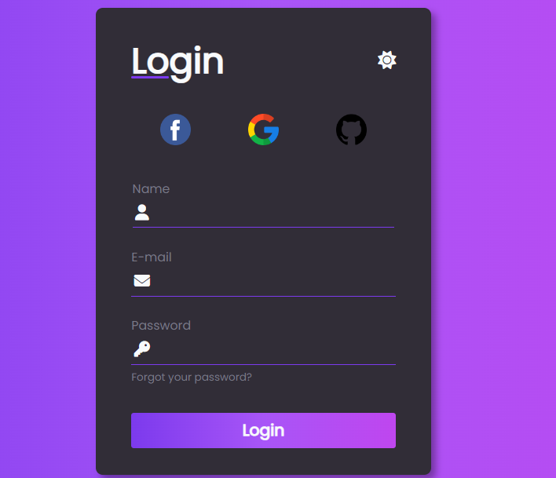

# FORMULARIO DARK
👨‍🏫FORMULARIO EM HTML, CSS E JAVASCRIPT.

 <br>

## DESCRIÇÃO:
Este código HTML e JavaScript implementa um formulário de login com a funcionalidade de alternar entre modo escuro e claro.

* O formulário possui campos para nome, e-mail e senha, além de um botão de login.
* Ícones do Font Awesome representam o modo atual (lua para escuro e sol para claro).
* Clicando no ícone, o modo muda e a classe "dark" é adicionada/removida do formulário para alterar o estilo.

## COMO USAR?
### BAIXANDO O PROJETO:
* Clone o repositório para o seu sistema local:

```bash
git clone https://github.com/VILHALVA/FORMULARIO-DARK.git
```

* Navegue até o diretório do projeto.

```bash
cd FORMULARIO-DARK
```

* Descompacte o arquivo ZIP (se você baixou manualmente):

```bash
unzip FORMULARIO-DARK.zip
```

### EXECUTANDO O PROJETO:
1. Abra o arquivo `index.html` em seu navegador de preferência.
2. Clique no ícone de lua/sol para alternar entre os modos.

## NÃO SABE?
- Entendemos que para manipular arquivos em `HTML`, `CSS` e outras linguagens relacionadas, é necessário possuir conhecimento nessas áreas. Para auxiliar nesse aprendizado, oferecemos cursos gratuitos disponíveis:
* [Curso de HTML e CSS](https://github.com/VILHALVA/CURSO-DE-HTML-E-CSS)
* [Curso de JavaScript](https://github.com/VILHALVA/CURSO-DE-JAVASCRIPT)
* [Confira mais cursos](https://github.com/VILHALVA?tab=repositories&q=+topic:CURSO)

## CREDITOS:
- [PROJETO CRIADO POR "LARISSAKICH"](https://github.com/Larissakich/dark_light_form)
- [PROJETO DO VIDEO DO YOUTUBE](https://youtu.be/qKWApkuhNu8?si=4cBoYzB0N4nOTjq9)
- [PROJETO EDITADO PELO VILHALVA](https://github.com/VILHALVA)
- [ESTÁ DISPONIVEL NO SITE](https://vilhalva.github.io/STYLER/STYLER.html)


